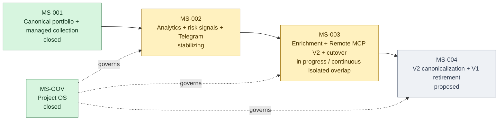
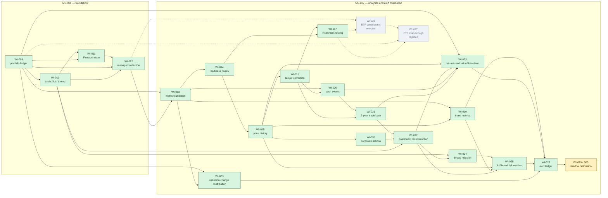
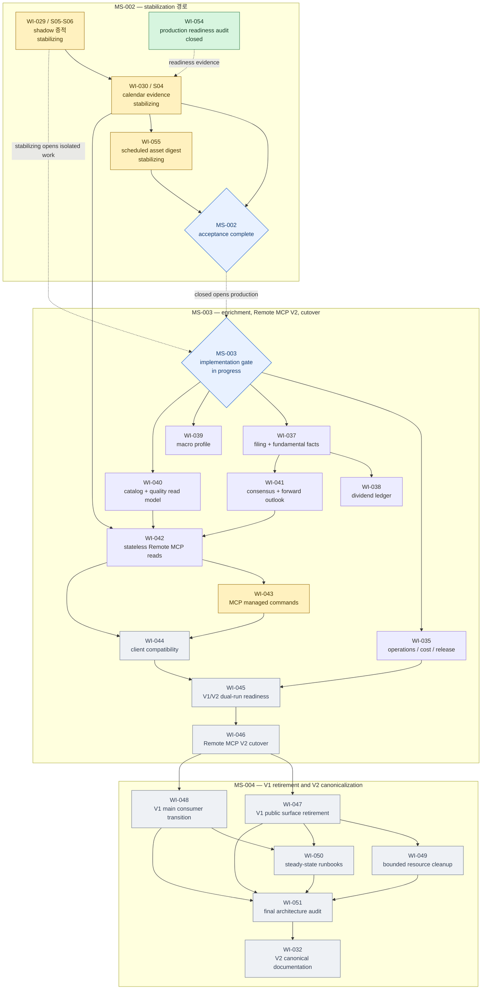

# Milestone and Work Item control

Milestone은 승인된 요구와 설계 delivery item을 실행 가능한 Work Item으로 묶는 기준선이다. 식별자와 관계의
machine-readable SSOT는 `governance/project/milestones.toml`, 상태·작업·증거의 SSOT는 개별
`docs/work-items/WI-*.md`, 전체 연결은 `docs/traceability.md`가 담당한다.

## 상위 설계와 매핑 문서

| 알고 싶은 것 | 문서 |
| --- | --- |
| V2의 시스템 구성·경계 | [`docs/design/kis-portfolio-v2-system-design.md`](../design/kis-portfolio-v2-system-design.md) |
| 승인 설계를 구현 단위로 나눈 계획 | [`docs/design/kis-portfolio-v2-delivery-plan.md`](../design/kis-portfolio-v2-delivery-plan.md) |
| milestone별 outcome·인수 조건·사람이 읽는 순서 | 이 문서와 [`MS-002`](./MS-002-portfolio-analytics-alerting.md), [`MS-003`](./MS-003-enrichment-remote-cutover.md), [`MS-004`](./MS-004-v2-canonicalization-retirement.md) |
| Work Item identity·dependency·sequence의 정본 | [`governance/project/milestones.toml`](../../governance/project/milestones.toml) |
| 요구·결정·구현·증거 연결 | [`docs/traceability.md`](../traceability.md) |

아래 그래프는 registry의 관계를 사람이 읽기 쉽게 투영한 것이다. 관계가 충돌하면 그래프가 아니라
`governance/project/milestones.toml`이 우선한다. 화살표 `A → B`는 **B가 A의 완료를 요구한다**는 뜻이다.

## 프로그램 전체 마일스톤

실선 화살표는 구조적 dependency DAG다. 실행 gate는 두 단계다. MS-002가 `stabilizing`이면 MS-003을
`in_progress`로 열고, registry에서 검토된 Work Item을 dependency 순서와 단일 `in_progress` 제한 아래
repository 구현·fixture·local 또는 inactive 검증까지 연속 진행한다. 각 구현 단위는 `verified`까지 전진할
수 있지만 MS-002가 `closed`가 되기 전에는 production DB migration, live source activation,
Cloud Run/Scheduler 변경, public MCP activation과 cutover를 할 수 없다. rollback은 실선을 역방향으로
연결하지 않고 append-only feedback edge로 기록한다.

## 완료된 기반에서 현재 위치까지

다음 그래프는 MS-001과 MS-002의 실제 Work Item dependency를 보여준다. 초록색은 닫힌 작업, 노란색은
현재 관찰 중인 작업, 회색 점선 경로는 초기 V2에서 제외되어 역사만 보존하는 ETF 작업이다.

### 그래프에서 압축한 초기·거버넌스 Work Item

- `WI-000`~`WI-008`은 현재 milestone registry가 도입되기 전 Project OS, architecture, Data Governance,
  source inventory, V2 foundation과 V1→V2 전환을 만든 bootstrap/history다. 현재 실행순서를 결정하지 않으므로
  위 제품 dependency graph에는 넣지 않았고, 상태와 증거는 각 Work Item과 `docs/traceability.md`에 보존한다.
- MS-GOV 경로는 `WI-018 → WI-031 → WI-034 → WI-052 → WI-053 → WI-056 → WI-057`이며 모두 닫혔다.
  WI-056이 lifecycle과 overlap/recovery gate를 MS-002/MS-003에 dogfood했고 WI-057이 이를 continuous,
  phase-aware overlap으로 바로잡았다. 이 경로가 milestone
  identity, MS-003/004 baseline, 잔여 delivery ownership과 ETF 초기 V2 제외 결정, 이 dependency map을
  만들었다.
- 따라서 `docs/work-items/`에 파일이 있지만 그래프에 없는 번호가 곧 누락 작업을 뜻하지는 않는다.

## 현재 위치와 남은 Work Item 의존성

완료된 선행 Work Item은 그래프의 복잡도를 줄이기 위해 생략했다. 아래에는 아직 닫히지 않은 경로와
그 사이의 실제 dependency만 표시한다.

### 지금 무엇을 할 수 있는가

| 구분 | 현재 가능한 범위 |
| --- | --- |
| 계속 자동 진행 | `WI-029-S05/S06`: 2026-09-14까지 corrected DB-only shadow 증적 축적 |
| 운영 안정화 | `WI-030-S04`: 실제 Rich Message의 calendar-window 증거와 owner acceptance 축적 |
| 첫 슬롯 확인 | `WI-055`: 10:00/16:00 총자산 digest 수신과 Control-ledger terminal 상태 확인 |
| 현재 격리 구현 | dependency-ready인 `WI-043`; managed command의 repository 구현과 local verification만 허용 |
| MS-003 격리 구현 | registry의 reviewed continuous-overlap 목록을 dependency 순서대로 한 번에 하나씩 진행; isolated scope와 production effects none 필수 |
| MS-002 종료 전 불가 | MS-003 production DB migration·source activation·Cloud Run/Scheduler·public MCP·cutover |
| 별도 미래 intake | ETF constituent 수집과 look-through. `WI-026/027`은 초기 V2에서 rejected되어 재사용하지 않음 |

`WI-038`은 `WI-037`, `WI-041`도 `WI-037`을 기다린다. 사용자-facing Remote MCP 경로인 `WI-042`는
Telegram `WI-030`, catalog/quality `WI-040`, forward outlook `WI-041`이 모두 끝나야 시작한다. 이후
managed command(`WI-043`)와 client compatibility(`WI-044`)를 거쳐 dual-run과 production cutover로 간다.

## 불변 규칙

- Work Item ID는 발급 뒤 삭제·재사용·재번호화하지 않는다.
- 번호는 정렬이나 우선순위가 아니다. 실행순서는 `sequence`와 `depends_on`으로 관리한다.
- milestone 간 실행순서도 registry의 `depends_on`으로 관리하며 알 수 없는 dependency와 cycle은 gate에서
  실패한다.
- rollback/recovery는 dependency를 되감거나 cycle로 만들지 않는다. 새 sub-item/Work Item을 append하고
  `discovered_from`, `rollback_of`, `supersedes` feedback 관계로 연결한다.
- 기존 outcome 안의 발견 작업은 `WI-NNN-SNN` sub-item으로 append한다.
- 독립 acceptance 또는 rollback이 필요하면 현재 최댓값 다음의 새 WI를 발급한다.
- 순서·의존관계 변경은 해당 milestone 문서의 revision log에 남긴다.
- 완료된 WI는 새 범위를 흡수하기 위해 다시 정의하지 않는다.

## 변경 단위

마일스톤을 변경할 때 registry, 해당 milestone 문서, Work Item, traceability와 Project OS 검사를 같은
change set에서 갱신한다. 아직 마일스톤에 편입하지 않은 장기 설계 항목은 V2 delivery ID로만 유지하고
Work Item 번호를 미리 점유하지 않는다.

## 문서 revision

| Version | Date | Change | Identity / dependency impact |
| --- | --- | --- | --- |
| 2026-08-30.1 | 2026-08-30 | 상위 문서 지도, milestone 및 remaining Work Item Mermaid dependency graph 추가 | WI-053 append; 제품 dependency는 변경하지 않음 |
